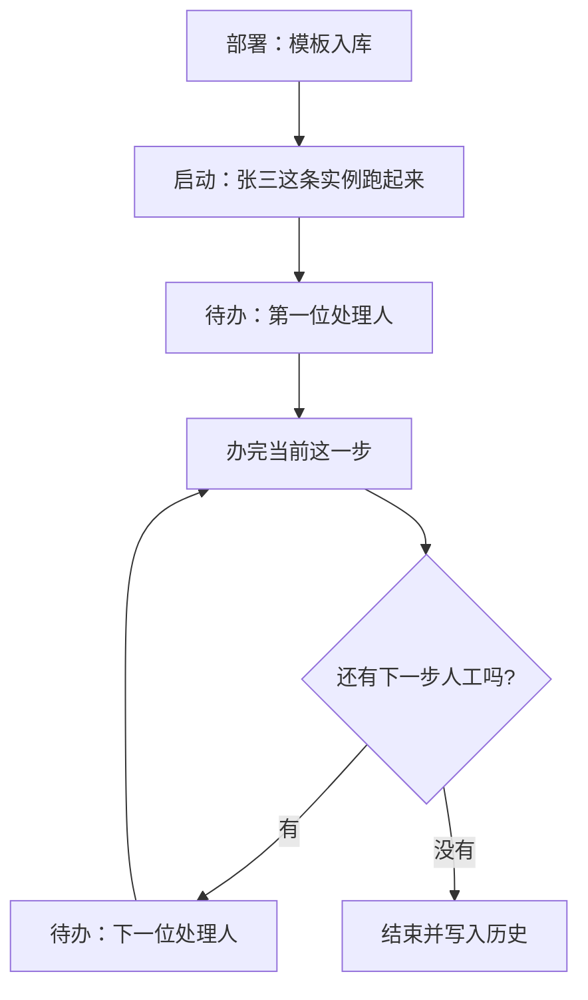

# Flowable + BPMN 快速入门（Java开发者版）

> **所属专题**: [框架技术](/framework/overview)
> 
> **适合人群**:
> - Java 开发者
> - 第一次接触 BPM / 工作流引擎
> - 想 1 天内快速理解 Flowable
> - 想做 OA / 审批流 / 企业流程系统（CRM、ERP、MES 等）
>
> **学习目标**:
> - 不深究复杂理论
> - 先真正理解：
>   - Flowable 与 BPMN 各自是什么、如何配合（第一节）
>   - 定义 / 实例 / 任务，以及「故事—引擎—库表」一条线（第二节）
>   - BPMN 常用节点、Service 与最小 API 闭环（后续节次）

---

## 一、Flowable 与 BPMN

**Flowable**：**BPMN 流程图 + Java 流程引擎**，用引擎去 **解释执行** 一份流程图 XML（类比：`.bpmn20.xml` 像流程版的「蓝图文件」，引擎负责按图推进、生待办、写历史）。

**BPMN**（Business Process Model and Notation）：一套 **业务流程建模与图形符号标准**；请假、采购审批等路径画在图里，落盘常见为 `*.bpmn20.xml`，本质仍是 **流程图 = XML**。不必先啃完整规范，能读懂「开始—人工节点—网关—结束」即可与后文对照。

Flowable 对外常做的事：解析 BPMN、创建与完成人工任务、按变量与网关推进、记录历史。

---

## 二、核心概念、一张单子与库表

先把 **流程定义 / 流程实例 / Task** 与下文的「故事 + 对照表」对齐，再一口气看完 **故事、库表前缀、动作在库里的含义**；避免概念与实例两张皮。

### 核心概念：定义、实例、任务

```text
流程定义 = 全员共用的「流程模板 / 蓝图」（部署进库后带版本）
流程实例   = 某一次业务受理开出的「一张在跑的单据」（一事一单）
Task       = 这张单子此刻卡在谁那儿的「待办一步」（谁现在该办什么）
```

对应关系：**门户待办** 多对应 **Task**；**规矩从哪来** 看 **流程定义**；**张三这一单** 是 **流程实例**。  
⚠️ **流程定义 ≠ 流程实例**：同一模板可起任意多条实例。

---

### 一张请假单的一生与对照表

**场景**：张三走公司的「请假流程」提交了一条申请。

**故事（业务视角）**

1. 行政先把「请假流程」放进系统 → **部署流程定义**
2. 张三点提交 → **启动流程实例**
3. 经理门户多出待办 → **创建 Task**
4. 经理同意并填意见 → **完成 Task**（引擎内部同时 **走连线、过网关**）
5. HR 门户出现待办 → **流程流转** 后再 **创建下一 Task**
6. HR 办完、无后续人工 → **流程结束**（运行态收尾，历史可查）

| 步骤 | 业务（故事） | Flowable 流程（术语） | 典型数据库表（示意） |
|:---:|:---|:---|:---|
| 1 | 行政把「请假流程」放进系统 | **部署流程定义** | `ACT_RE_DEPLOYMENT`、`ACT_RE_PROCDEF`、资源 XML（如 `ACT_GE_BYTEARRAY`） |
| 2 | 张三点提交 | **启动流程实例** | `ACT_RU_EXECUTION`、`ACT_RU_VARIABLE`；历史开始 `ACT_HI_PROCINST` 等 |
| 3 | 经理门户多出待办 | **创建 Task** | `ACT_RU_TASK` |
| 4 | 经理同意并填意见 | **用户处理 Task** + **流程流转** | `ACT_RU_TASK` 办结；变量 `ACT_RU_VARIABLE` / `ACT_HI_VARINST`；轨迹 `ACT_HI_TASKINST` 等 |
| 5 | HR 门户出现待办 | **创建下一 Task** | `ACT_RU_EXECUTION` 推进；新 `ACT_RU_TASK` |
| 6 | HR 办完 | **流程结束** | 运行侧 `ACT_RU_*` 清理；`ACT_HI_PROCINST` 等记结束与轨迹（以所用版本为准） |

**技术主线**（与上表同序）：

```text
部署流程定义
    ↓
启动流程实例
    ↓
创建 Task
    ↓
用户处理 Task（同意/拒绝 + 变量）
    ↓
流程流转（走连线、过网关）
    ↓
创建下一个 Task（若还有人工环节）
    ↓
流程结束
```



**小结**：主线可浓缩为两句——**单子现在在谁桌上？下一步该谁？** ——能对应到待办与执行位置即可。

---

### 表前缀与「数据库里在干什么」（简约）

引擎对外是 API，对内多是 **运行库变更 + 历史沉淀**。表名不必全背，先记三类前缀：

```text
ACT_RE_*  → 模板（定义与版本）
ACT_RU_*  → 进行中（实例、待办、运行变量）
ACT_HI_*  → 历史（已办、已结束、审计轨迹）
```

与上表的关系：**部署** 主要写 `RE_*`；**在跑的单子与待办** 看 `RU_*`；**办结后查谁批过、何时结束** 看 `HI_*`。  
动作上可一句话串起来：**模板进 RE → 启动挂 RU → 待办在 `ACT_RU_TASK` → 办完消当前待办、需要则再插下一条 → 结束清 RU、轨迹落 HI**（细节随版本略有差异）。

---

## 三、BPMN 核心节点（必须掌握：图形与待办、流转的对应）

BPMN 是画图语言。不必死记英文节点全称，抓住 **图上每一块在待办列表与流程走向里对应什么** 即可。

### 1. StartEvent（开始事件）

作用：

```text
流程入口（发令枪：从这儿开始跑）
```

在业务系统里，**待办里一般不会单独出现一个叫「开始」的节点**，但这是引擎 **启动实例时必须经过的起点**。

---

### 2. EndEvent（结束事件）

作用：

```text
流程结束（跑到这儿整条线收尾）
```

办结后，在「我发起的」等入口里会显示已完成；**不会再产生新的审批待办**。

---

### 3. UserTask（人工任务）⭐ 最重要

例如：

```text
经理审批
HR 审批
```

真正会生成：

```text
待办任务
```

**流程图上每一个「人工任务」方块，对应某个时刻、某个人在待办列表里会看到的一条。**  
对接需求时最常问的一句是：**「这一步谁批？」** ——图上就多一个 UserTask。

---

### 4. SequenceFlow（连线）

作用：

```text
默认路线图：上一步办完，单子接着往哪儿传
```

例如：

```text
开始 → 审批 → 结束
```

没有连线，引擎不知道 **A 办完以后默认去 B 还是去 C**；连线就是 **不接条件时的默认走向**。

---

### 5. ExclusiveGateway（排他网关）⭐ 核心节点

作用：

```text
条件分叉（if-else）：走到岔路口只选一条路继续
```

例如：

```text
请假天数 > 3 天
→ 老板审批

否则
→ 直接结束
```

可把它想成 **岔路口一次只放行一辆车**：根据流程变量算出条件后，**只会走进其中一条分支**。  
业务上「按金额/风险走不同审批链」，在图上多半是 **网关 + 多条出线 + 各自条件**。

---

## 四、常用 Service 与最核心的 4 个 API

日常开发里 **先认 Service，再记具体方法**：下面一张表是 Spring Boot 集成后最常见的几块能力边界；后面的 **4 段示例** 对应其中四个最常用的入口（部署、起流程、查待办、办任务），也是最小闭环里最先要跑通的调用。

### 常用 Service 一览

| Service（注入名常见写法） | 主要职责 | 常见用法场景 |
|:---|:---|:---|
| **RepositoryService** | 流程**定义**：部署、删除部署、查流程定义与资源 | `createDeployment()`、`createProcessDefinitionQuery()` |
| **RuntimeService** | 流程**实例**（运行中）：启动、挂起/激活、删实例、读写运行变量、触发信号/消息 | `startProcessInstanceByKey()`、`setVariable()`、`createProcessInstanceQuery()` |
| **TaskService** | **人工任务**：待办查询、认领/委派/转办、完成、加签相关操作、任务局部变量 | `createTaskQuery()`、`complete()`、`claim()`、`setAssignee()` |
| **HistoryService** | **历史与审计**：已办任务、已结束实例、历史变量、流程图已执行高亮数据 | `createHistoricTaskInstanceQuery()`、`createHistoricProcessInstanceQuery()` |
| **ManagementService** | **引擎与作业**：定时器、异步作业、执行引擎命令、数据库表信息（偏运维/排障） | `createTimerJobQuery()`、`executeCommand()` |
| **IdentityService** | **用户/组**（引擎内置身份表） | 小型 Demo 或对接简单组织；**企业项目里常不用它**，改对接自家用户中心 + 在任务上写业务用户 ID |
| **FormService** | **引擎表单**（start / task 表单数据） | 若采用 Flowable 表单模型；**很多项目用自建表单**，仅把业务主键放进流程变量 |
| **DynamicBpmnService** | **不重新部署**前提下动态改定义中的部分属性（进阶） | 热调开关类配置；需理解缓存与影响面后再用 |

说明：实际类名以你项目依赖的 Flowable 版本为准；上表帮助 **按职责找入口**，避免所有事都往 `TaskService` 里堆。

---

### 最核心的 4 个 API（最小闭环）

#### 1. 部署流程（RepositoryService）

```java
repositoryService
    .createDeployment()
    .addClasspathResource("leave.bpmn20.xml")
    .deploy();
```

作用：

```text
部署 BPMN 流程图到数据库
```

---

#### 2. 启动流程（RuntimeService）

```java
Map<String, Object> vars = new HashMap<>();
vars.put("days", 5);
vars.put("applicant", "zhangsan");

runtimeService.startProcessInstanceByKey(
    "leaveProcess",
    vars
);
```

作用：

```text
创建流程实例
```

---

#### 3. 查询待办任务（TaskService）

```java
List<Task> tasks = taskService.createTaskQuery()
    .taskAssignee("wang")  // 审批人
    .list();
```

作用：

```text
查询当前用户的待办任务
```

---

#### 4. 审批任务 / 推进流程（TaskService）

```java
taskService.complete(taskId);
```

⚠️ **核心理解**：

```text
complete() 不只是"审批完成"

它真正作用是：
推进流程继续执行
```

闭环跑通之后，**查已办、查某次流程跑过哪些节点**，一般改用 **HistoryService** 上的各类 `createHistoric*Query()`，与上表对应。

---

## 五、Flowable 是如何流转的？

这是整个引擎的核心机制。

Flowable 本质：

```text
控制 Token 在流程图中移动
```

你可以理解成：

```text
Token = 当前流程执行位置指针
```

例如流程：

```text
开始
→ 经理审批
→ HR 审批
→ 结束
```

当前状态：

```text
Token 在"经理审批"节点
```

经理审批完成后：

```text
Token 移动到"HR 审批"节点
然后创建新的 Task
```

---

## 六、为什么不会一次性生成所有任务？

Flowable 采用 **懒创建** 策略：

❌ **不是**：

```text
预生成所有审批节点的任务
```

✅ **而是**：

```text
走到哪一步
创建哪一步的 Task
```

例如：

```text
开始
→ 经理审批
→ HR 审批
→ 结束
```

启动流程后：

```text
只会创建"经理审批"任务
```

经理审批完成后：

```text
才会创建"HR 审批"任务
```

---

## 七、流程变量

### 是什么、存在哪

流程变量是 **流程运行时的上下文数据**（天数、金额、是否同意、临时算出的审批人等），挂在流程实例上供引擎与业务读写。

```java
Map<String, Object> vars = new HashMap<>();
vars.put("days", 5);
vars.put("amount", 20000);
vars.put("manager", "wang");
vars.put("applicant", "zhangsan");
```

运行期常见落库：`ACT_RU_VARIABLE`（与历史变量等表配合做审计，具体以所用版本为准）。

### 用来干什么

**不只是存档**，更核心的是 **驱动流程决策**：排他网关上的 `${days > 3}`、人工节点的办理人表达式 `${manager}` 等，都要 **读变量** 才能决定 **往哪走、派给谁**。

例如：

```text
days > 3
→ 老板审批

否则
→ 直接结束
```

下一节「条件流转」会把变量与网关、XML 条件写法串起来。

---

## 八、条件流转（企业核心场景）

BPMN 流程图：

```text
经理审批
    ↓
  排他网关
   ↙       ↘
days > 3   days <= 3
  ↓           ↓
老板审批      结束
```

对应 XML 配置：

```xml
<sequenceFlow 
    sourceRef="gateway" 
    targetRef="bossApproval">
    <conditionExpression>${days > 3}</conditionExpression>
</sequenceFlow>
```

Flowable 会：

1. 读取流程变量 `days`
2. 判断条件表达式
3. 动态决定流程走向

---

## 九、动态审批人（企业核心）

❌ **常见误解**：

```text
BPMN 中会写死审批人
```

✅ **实际企业实践**：

```text
运行时动态计算审批人
```

例如：

```java
// 根据申请人查找直属领导
String manager = orgService.findLeader(applicantUserId);

// 将审批人作为流程变量传入
vars.put("manager", manager);
```

BPMN 配置：

```xml
<userTask 
    id="managerApproval" 
    name="经理审批"
    flowable:assignee="${manager}" />
```

---

## 十、审批页面怎么实现？

⚠️ **重要理解**：

Flowable 只负责：

```text
生成待办任务
```

真正的审批页面由 **业务系统** 实现：

```text
我的待办列表
→ 查看审批详情
→ 同意/拒绝按钮
→ 填写审批意见
```

前端技术栈：

- Vue.js / React
- Element UI / Ant Design

---

## 十一、审批操作如何推进流程？

用户点击"同意"按钮后：

后端代码：

```java
@PostMapping("/approve")
public void approve(@RequestParam String taskId,
                    @RequestParam boolean approved,
                    @RequestParam String comment) {
    
    Map<String, Object> vars = new HashMap<>();
    vars.put("approved", approved);
    vars.put("comment", comment);
    
    // 完成任务并传递变量
    taskService.complete(taskId, vars);
}
```

然后 Flowable 自动：

1. ✅ 完成当前任务
2. ✅ 判断条件网关
3. ✅ 流转流程
4. ✅ 创建下一个 Task

---

## 十二、Listener（监听器）

Flowable 提供生命周期监听机制。

### TaskListener

监听任务生命周期事件：

- `create` - 任务创建
- `assignment` - 任务分配
- `complete` - 任务完成
- `delete` - 任务删除

---

### 经典应用场景

任务创建后发送通知：

```java
public class NotifyListener implements TaskListener {

    @Override
    public void notify(DelegateTask task) {
        String assignee = task.getAssignee();
        String taskName = task.getName();
        
        // 发送企业微信/钉钉通知
        wechatService.sendMessage(assignee, 
            "您有新的待办任务：" + taskName);
    }
}
```

BPMN 配置：

```xml
<userTask id="managerApproval" name="经理审批">
    <extensionElements>
        <flowable:taskListener 
            event="create" 
            class="com.example.NotifyListener" />
    </extensionElements>
</userTask>
```

---

## 十三、Flowable 与传统系统的最大区别

### 传统系统（硬编码）

```text
订单创建
→ 一次性生成所有任务
→ 大量 if-else 判断
```

问题：

- ❌ 流程变更需要改代码
- ❌ 条件复杂时代码难以维护
- ❌ 无法可视化查看流程

---

### Flowable（流程引擎）

```text
流程推进到哪一步
→ 创建哪一步的 Task
→ 通过 BPMN 配置条件
```

优势：

- ✅ 流程变更只需修改 BPMN
- ✅ 条件逻辑可视化配置
- ✅ 支持流程版本管理
- ✅ 完整的审批历史记录

---

## 十四、Flowable 的真正本质（最终理解）

Flowable 并不是：

```text
简单的审批系统
```

它的真正本质是：

```text
流程状态机引擎
或
流程图解释执行器
```

核心组成：

```text
BPMN 流程定义（蓝图）
+
流程变量（上下文数据）
+
Task 任务系统（待办管理）
+
条件网关（流程分支）
+
流程状态流转（Token 移动）
```

---

## 十五、推荐学习路线

### 第一步：跑通最简单 Demo

流程：

```text
开始
→ 经理审批
→ 结束
```

目标：

- 部署流程
- 启动流程实例
- 查询待办任务
- 完成任务
- 观察数据库变化

---

### 第二步：深入理解核心操作

实际操作：

- ✅ `startProcessInstanceByKey()` - 启动流程
- ✅ `createTaskQuery()` - 查询任务
- ✅ `complete()` - 完成任务
- ✅ 查看 `ACT_RU_*` 和 `ACT_HI_*` 表的变化

---

### 第三步：学习条件流转

掌握：

```text
ExclusiveGateway（排他网关）
+
流程变量
+
条件表达式
```

---

### 第四步：进阶特性

再学习：

- 动态审批人
- TaskListener 监听器
- ParallelGateway（并行网关）
- Multi-instance（会签/多实例）
- Sub-process（子流程）

---

## 十六、最后一句（最重要）💡

学习 Flowable：

❌ **千万不要**一开始就：

```text
研究全部 BPMN 节点
陷入理论细节
```

✅ **正确方式**：

```text
先跑通流程
再理解流转机制
最后深入学习高级特性
```

当你真正：

```java
startProcessInstanceByKey()
    ↓
createTaskQuery()
    ↓
complete()
```

完整跑通一次后，你会突然理解：

```text
原来所谓审批流
本质就是数据库驱动的状态机
```

---

## Flowable 企业二开（扩展阅读）

从零跑通入门后，若要在真实项目里拆分 **业务规则层、平台能力层、引擎层** 三类二开，并弄清各自边界，见：[Flowable 企业二开（三层二开体系）](/tech-system/backend/flowable-enterprise-extensions)。

---

## 学习资源

- 📘 Flowable 官方文档：<https://www.flowable.com/open-source/docs>
- 📗 BPMN 2.0 规范：<https://www.bpmn.org/>
- 💻 GitHub 示例项目：<https://github.com/flowable/flowable-engine>
- 📚 中文教程：<https://blog.csdn.net/category_12345678.html>（搜索 Flowable 教程）
- 🎯 BPMN 在线编辑器：<https://bpmn.io/>

---

## 实战建议

对于中小型企业项目（OA、CRM、ERP 等）：

1. **从简单流程开始**：不要一开始就设计复杂流程
2. **重视流程变量**：它是驱动流程决策的核心
3. **善用监听器**：实现通知、日志等业务逻辑
4. **版本管理**：流程变更时注意版本控制
5. **性能优化**：历史表数据量大时需定期清理

> **适用场景**：OA 审批、CRM 合同审核、ERP 采购流程、MES 工单流转等企业级管理系统。
