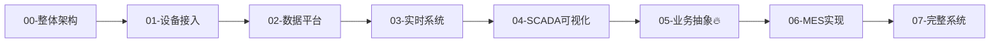

# 工业数字化设计（IoT + SCADA Lite + MES Lite）

> **基于 RuoYi-Pro 构建中小企业智能制造解决方案**

## 📖 模块简介

本模块系统性地讲解如何基于 **RuoYi-Pro** 快速构建轻量级工业数字化系统，涵盖：

- **IoT 设备接入层**: PLC、传感器数据采集与协议适配（Modbus/S7/MQTT）
- **SCADA Lite 监控层**: 实时数据可视化、报警管理、历史趋势
- **MES Lite 业务层**: 生产计划、工单管理、质量追溯、OEE 分析

**适用场景**: 中小企业智能制造转型、设备监控系统、生产管理轻量化落地

---

## 🗺️ 学习路线图



---

## 📚 文档目录

### 🏗️ 基础篇

#### [00-工业数字化整体架构](./00-architecture-overview.md)
- 系统分层架构设计
- 技术选型对比（TDengine vs InfluxDB）
- RuoYi-Pro 集成方案
- 快速开始指南

#### [01-设备接入与数据采集](./01-device-access.md)
- Modbus TCP 协议详解与 Netty 实现
- Siemens S7 协议与 Snap7 库使用
- MQTT 设备上报与 EMQX 集成
- 统一数据模型设计
- 边缘计算与数据清洗

#### [02-数据平台设计（存储/处理）](./02-data-platform.md)
- 时序数据库选型对比
- TDengine 超级表设计
- Spring Boot 集成实战
- 性能优化策略（批量写入、索引、分区）
- 数据分层存储（热/温/冷）
- Grafana 可视化集成

#### [03-实时系统设计](./03-realtime-system.md)
- WebSocket 双向通信实现
- Netty 高性能网关设计
- 实时告警引擎（阈值判断、防抖、分级）
- 前端实时数据刷新策略
- 消息推送可靠性保障

---

### 🎨 应用篇

#### [04-工业可视化（SCADA）](./04-scada-visualization.md)
- SVG/Canvas 组态画面绘制
- 设备状态实时绑定
- ECharts 历史趋势曲线
- 报警管理中心
- 监控大屏设计

#### [05-业务抽象设计（核心🔥）](./05-business-abstract.md)
> **本章是整个系列的灵魂**，理解业务建模才能设计出真正可用的系统

- 设备模型抽象与层级关系（工厂→车间→产线→工位→设备）
- 工单流程设计与状态机（创建→审核→下发→执行→完成）
- 生产节拍计算与瓶颈分析
- **OEE（设备综合效率）深度解析**
  - 可用率 × 性能率 × 合格率
  - 六大损失分析
  - 计算引擎实现
- 质量追溯体系设计（正向/反向追溯）

#### [06-轻量MES能力实现](./06-mes-lite.md)
- 工单管理模块（Controller/Service/Mapper）
- 工艺路线设计器（AntV X6）
- 质量检验流程（IQC/IPQC/FQC）
- 物料管理与领退料
- 追溯查询接口
- RuoYi-Pro 集成要点（菜单、权限、字典）

---

### 🚀 部署篇

#### [07-完整系统设计与实现](./07-full-system.md)
- Docker Compose 编排（MySQL/Redis/TDengine/EMQX）
- Nginx 反向代理配置
- 性能优化策略
  - 数据库索引优化
  - Redis 缓存策略
  - TDengine 批量写入
  - 前端懒加载
- 监控与告警（Prometheus + Grafana）
- 常见问题排查
- 一键部署脚本

---

## 🎯 前置知识

建议先了解以下内容：

- [PLC 基础知识](../plc/common-brands.md) - 常见品牌与选型
- [Modbus TCP 通信](../integration/modbus-tcp-node-plc.md) - 协议原理
- [Siemens S7 协议](../plc/s7-python-data-collection.md) - 内存结构与采集
- [物联网项目学习路线](../backend/iot-project.md) - 设备接入概览

---

## 💡 技术栈总览

### 后端
- **框架**: RuoYi-Pro (Spring Boot 3.x + MyBatis Plus)
- **通信**: Netty (TCP) + MQTT (EMQX)
- **数据库**: MySQL 8.0 + Redis 7.x + TDengine 3.x
- **文件存储**: MinIO

### 前端
- **框架**: Vue 3 + TypeScript
- **UI 库**: Element Plus
- **图表**: ECharts 5.x
- **组态**: SVG + AntV X6

### 运维
- **容器化**: Docker + Docker Compose
- **监控**: Prometheus + Grafana
- **日志**: ELK Stack（可选）

---

## 🚀 快速开始

```bash
# 1. 克隆 RuoYi-Pro 项目
git clone https://gitee.com/JavaLionLi/RuoYi-Vue-Plus.git

# 2. 启动基础服务
docker-compose up -d

# 3. 初始化数据库
mysql -uroot -proot123 ry_plus < sql/ry_plus.sql

# 4. 启动后端
cd ruoyi-admin
mvn spring-boot:run

# 5. 启动前端
cd ruoyi-ui
npm install
npm run dev
```

详细步骤请参考 [00-整体架构概览](./00-architecture-overview.md)

---

## 📊 预期成果

完成本系列学习后，你将能够：

✅ 独立设计工业 IoT 系统架构  
✅ 实现多协议设备接入（Modbus/S7/MQTT）  
✅ 构建高性能时序数据平台  
✅ 开发 SCADA 实时监控画面  
✅ 理解并实现 OEE 计算引擎  
✅ 搭建轻量级 MES 系统  
✅ 使用 Docker 完成一键部署  

---

## 🔗 相关资源

- [RuoYi-Pro 官方文档](https://plus-doc.dromara.org/)
- [TDengine 时序数据库](https://docs.taosdata.com/)
- [EMQX MQTT Broker](https://www.emqx.io/)
- [Netty 权威指南](https://github.com/netty/netty)
- [ECharts 官方示例](https://echarts.apache.org/examples/)

---

**开始你的工业数字化转型之旅！🚀**
